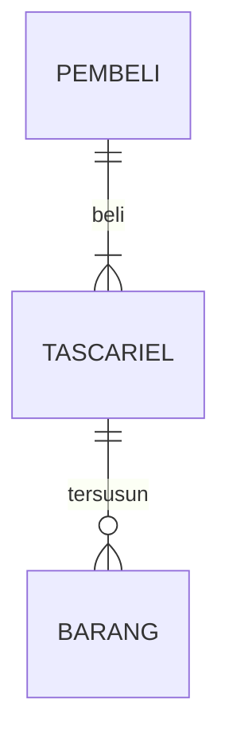

## 1.1 Latar Belakang
furhes mountain  adalah websait e-commerce , yang menawarkan produk atau barang peralatan untuk mendaki gunung  contoh (tas carrier , sepatu gunung,headlamp,tenda,dll)
Website ini menawarkan kemudahan untuk belanja secara online terutama untuk para pencinta gunung dan Website ini bertujuan untuk memberikan kemudahan dalam jual beli produk

## 1.2. Deksripsi Teknologi Informasi
Website e-commerce dan teknologi informasi saling terkait erat. Teknologi informasi digunakan untuk mengembangkan, mengamankan, dan mengelola website e-commerce, termasuk manajemen inventori, pembayaran online, analitik web, integrasi sistem, responsivitas mobile, SEO, serta layanan pelanggan. Ini membuat teknologi informasi menjadi tulang punggung bagi operasi website e-commerce, memungkinkan bisnis menjalankan operasi online mereka dengan efisien dan memberikan pengalaman berbelanja yang baik bagi pelanggan.

## 1.3. Branding
website ini cocok untuk para pencinta gununung yang mana website ini menyediakan peralatan atau logistik mendaki gunung

## 2. User Story

Sebagai  | Bisa Melakukan | Sehingga  | Prioritas
---|---  |---|---
Pengguna | Membeli produk | Bisa membeli produk | ⭐⭐⭐⭐⭐
Pengguna | Melihat gambar dan harga produk | Bisa melihat lihat produk | ⭐⭐⭐⭐⭐
Pengguna | mencari produk | Bisa mencari produk yang di inginkan dengan mudah | ⭐⭐⭐⭐⭐
Pengguna | login | sehinnga pengguna dapet mengatur alam pengiriman dan menyimpan barang (keranjang)| ⭐⭐⭐⭐⭐
## 3. Struktur Data

Cara membuat aneka macam bentuk grafik menggunakan mermaid.js bisa lihat di [https://mermaid.js.org/syntax/entityRelationshipDiagram.html](https://mermaid.js.org/syntax/entityRelationshipDiagram.html) 

## 4. Arsitektur Sistem

Masih pake mermaid.js juga bisa lihat flowchart di [https://mermaid.js.org/syntax/flowchart.html](https://mermaid.js.org/syntax/flowchart.html)

## 5. Teknologi, Library, dan Framework

bla bla bla

## 6. Desain User Experience dan User Interface

Bisa load image 

## 7. Demonstrasi Video

Link youtube nya

## 8. Bagaimana mesin komputasi dan sistem operasi berperan dalam produk teknologi informasimu ?

Link youtube nya di detik jawaban ini

## 9. Bagaimana algoritma, struktur data, dan bahasa pemrograman berperan dalam produk teknologi informasimu ?

Link youtube nya di detik jawaban ini

## 10. Bagaimana metode pengembangan perangkat lunak / Software Development Life Cycle berperan dalam produk teknologi informasimu ?

Link youtube nya di detik jawaban ini

## 11. Bagaimana database / sistem basis data berperan dalam produk teknologi informasimu ?

Link youtube nya di detik jawaban ini
